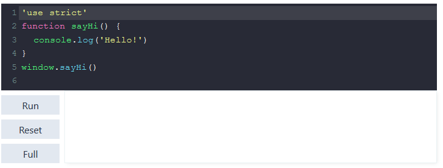
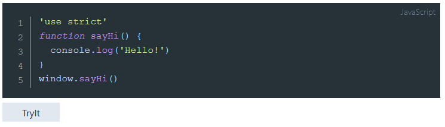

# nuxt-content-try-it-module 

### Introduction
Try-It module is created specifically for nuxt/content environment.
It contains couple of vue components which do convertion of code-blocks into editable and executable ones (with usage of CodeMirror Editor).

Try-It components are useful for technical writers who use code snippets to demonstrate JavaScript or HTML language specific examples or behaviours. 

Tri-It components add capability to evaluate/run JavaScript (or HTML) snippet just on place, or in full screen mode.

The components are used inside markdown content and do not break usual style of markdown text and formatting.

### Dependencies

[vue-codemirror](https://www.npmjs.com/package/vue-codemirror)


### Usage

Try-it component is placed just ater codeblock:

\<try-it-block> and \<try-it-button> components are placed just ater codeblock:

```md[markdown document]
    ```javascript[JavaScript]
    'use strict'
    function sayHi() {
      console.log('Hello!')
    }
    window.sayHi()
    ```
    <try-it-block id="1"></try-it-block>
```  

--------------------------------------------------------- ----  


**\<try-it-block> component** converts codeblock into editable codeMirror snippet and adds output window, which is dedicated to show HTML-output for html-snippets and CONSOLE-output for JavaScript snippets after click on "Run" button:



--------------------------------------------------------- ----  

**\<try-it-button> component** is easier: it only adds button "Try It", which redirects user to full screen \<try-it-page> component:

```md[markdown document]
    ```javascript[JavaScript]
    'use strict'
    function sayHi() {
      console.log('Hello!')
    }
    window.sayHi()
    ```
    <try-it-button id="1"></try-it-button>
```
Here is the result:



--------------------------------------------------------- ----  

**\<try-it-page> component** occupies a full page, it should be created by user in **/pages** directory:

```html[code.vue]
<template>
  <try-it-page />
</template>
```
It behaves fully as \<try-it-block>, but on the sepatate page. To allow user to go back there adiitional button "Go Back To Continue Reading" is introduced, it redirects user to the same place where user pressed the button "Full screen" or "Try It".  

--------------------------------------------------------- ----  

**\<try-it-img>** component is additional, complementary and serves to show images, placed to ***/assets/images*** folder 


### Setup
Insert following lines into ***nuxt.config.js*** 
```js[nuxt.config.js]
modules: [
   '@nuxt/content',
   . . .
   'nuxt-content-try-it-module'
],
  tryIt: {
    buttons: {
     . . .
    },
    page: 'code',
    theme: 'default'
  },
```
or you can use short notation:
```js[nuxt.config.js]
modules: [
   '@nuxt/content',
   . . .
   ['nuxt-content-try-it-module',
     {
       buttons: {
        . . .
       },
       page: 'code',
       theme: 'default'
  }
],
```
Add CodeMirror themes you want to use into ***nuxt.config.js*** section CSS:
```js[nuxt.config.js]
  css: ['codemirror/theme/base16-dark.css',
        'codemirror/theme/dracula.css',
        . . . . .
       ],
```
Install Try-it-module 
```powershell[PowerShell]
$ cd demo
$ yarn add nuxt-content-try-it-module
# generate static project
$ yarn generate
$ yarn start
```
Add page for \<try-it-page>

> Name of this page is configurable in **options** (default is "code.vue")

## Nuxt directories
Try-It-module uses the following special directories of the nuxt project: 

### `assets`

The assets directory contains two important subfolders:
* ***/assets/css***  - used for keeping tryIt.css file
* ***/assets/images*** - for images, placed by customer, to be shown with \<try-it-img> component 

### `static`

The static directory is important for Try-It-Components execution process, it keeps correspondent JavaScript and CSS files.

### `store`

Store is used by Try-It-Components settings, it should be kept.

### `pages`

Additinal page **code.vue** (default name) should be added to this folder manually. This page is necessary for ***\<try-it-page>*** implementation.

Text of this file is done in ***Usage*** section hereabove.

## Configuration
### `Settings`
Options JSON:

```json[options]
{
    buttons: {
      tryIt: "TryIt",
      run: "Run",
      reset: "Reset",
      value: "Evaluate",
      fullScreen: "FullScreen",
      backToRead: "BackToRead"
    }, 
    page: 'code',
    theme: 'default'
  }
```

----------------------
| Option| Button name | Description |
|:----:|:------:|:-----------:|
| buttons | tryIt | button caption for \<try-it-button> component |
| buttons | run | button caption for RUN function in \<try-it-block> and \<try-it-page>  components |
| buttons | reset | button caption for RESET CHANGES function in \<try-it-block> and \<try-it-page>  components |
| buttons | value | button caption for EVALUATE function \<try-it-block> and \<try-it-page>  components |
| buttons | fullScreen | button caption for \<try-it-block> component (same function as "tryIt" button |
| buttons | backToRead | button caption for GO BACK function in \<try-it-page>  component |
| code | &nbsp; | page name for \<try-it-page>  component |
| theme | &nbsp; | theme name of codeMirror (corespondent CSS should be present in ***nuxt.config.js*** (section CSS) |

--------------------------  
> 1) Default values will be applied unless user changes it in ***nuxt.config.js***
> 2) CodeMirror theme can be re-set separately in every item of \<try-it-block> component. 


### Props
--------------
#### \<try-it-button>, \<try-it-block>
* **id** (string) is required. User should check if all \<try-it-...> items have different id-s on one Markdown page.
* **theme** (string) - not required. Is used for CodeMirror theme, which can be changed for every other \<try-it-block> on the same page. Make sure that css-file for theme is included into ***nuxt.config.js*** (CSS section). 

> CodeMirror theme for \<try-it-page> is taken from **options** (see hereafter).  
-----------------  

#### \<try-it-img>
* **src** (string) - image file name
* **alt** (string) -  alternative text, which is shown when cursor is above the image
----------------

### Caution
> It is forbidden in nuxt/content/markdown to use self-closing tags: <span style="text-decoration: line-through">\<try-it-button id="1" /></span>


## Inspiration

Component development was inspired by MDN live examples and uses console support taken from [MDN BoB](https://github.com/mdn/bob/tree/master/editor/js/editor-libs) and CodeMirror library.